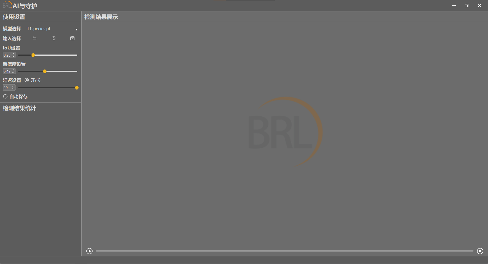
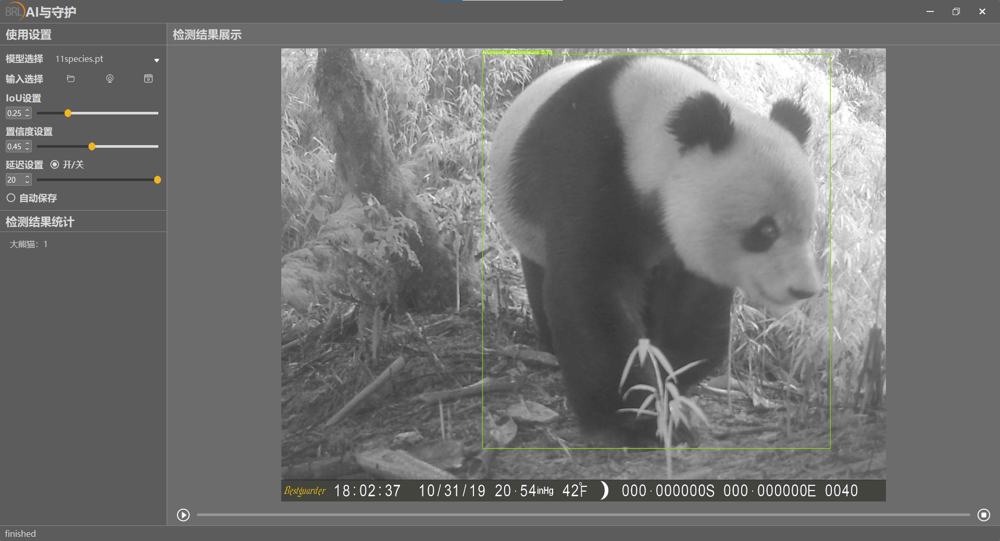
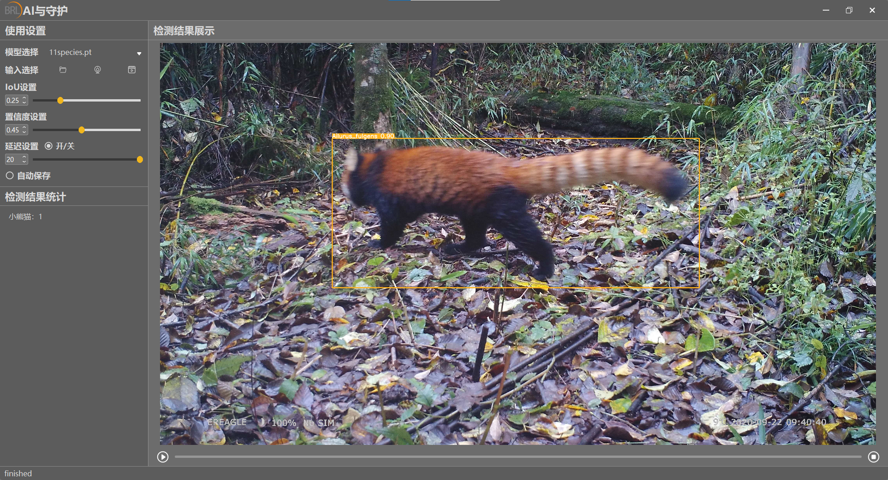

# YOLOv5动物目标检测

## 1.数据预处理

* 在近万张野外环境下的源图像中选择了4000张左右的图片，包含11个物种

  | **物种**                         | **数量** |
  | -------------------------------- | -------- |
  | Asian_black_bear[亚洲黑熊]        | 185      |
  | Bos_taurus[家牛]                 | 563      |
  | Capra_aegagrus_hircus[家羊]      | 254      |
  | Ailurus_fulgens[小熊猫]          | 270      |
  | Siberian_weasel[黄鼬]            | 278      |
  | Tibetan_macaque[藏酋猴]          | 1480     |
  | Ailuropoda_melanoleuca[大熊猫]   | 176      |
  | Canis_lupus_familiaris[狗]       | 158      |
  | Hystrix_brachyura_hodgsoni[豪猪] | 166      |
  | Leopard_cat[豹猫]                | 229      |
  | Masked_palm_civet[果子狸]        | 165      |
  | 共计11个物种                     | 3924     |

* 实验数据集采用[LabelImg](https://github.com/heartexlabs/labelImg)进行标注，标注格式采用COCO数据集格式

## 2.模型训练

* 根据图像特点分为昼间图像（RGB图像）和夜间图像（红外图像），划分出昼间数据集、夜间数据集以及混合数据集进行训练

* 基于早期YOLOv5框架，引入注意力机制增强模型特征提取能力，通过消融实验验证其作用

  |  评价标准  | 昼间  | 夜间  | 混合  |
  | :--------: | :---: | :---: | :---: |
  | 平均准确率 | 0.970 | 0.915 | 0.955 |
  | 平均召回率 | 0.960 | 0.910 | 0.950 |

## 3.可视化展示

## 4.PyQt5用户界面

* 此部分代码主要参考[Javacr](https://github.com/Javacr)/[PyQt5-YOLOv5](https://github.com/Javacr/PyQt5-YOLOv5)的项目实现，在此特别感谢
* 可视化展示如下：
  
  
  
